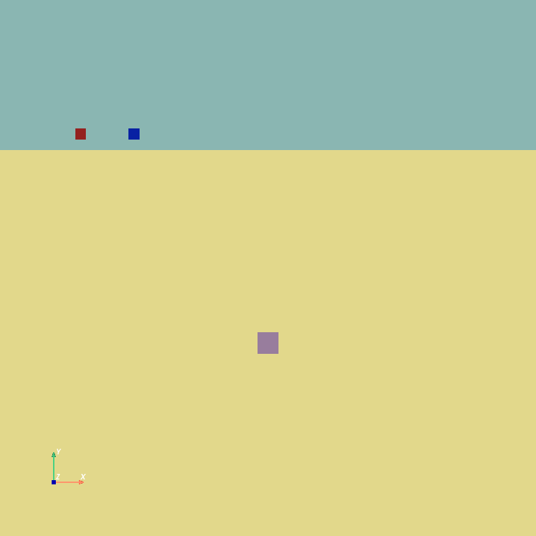
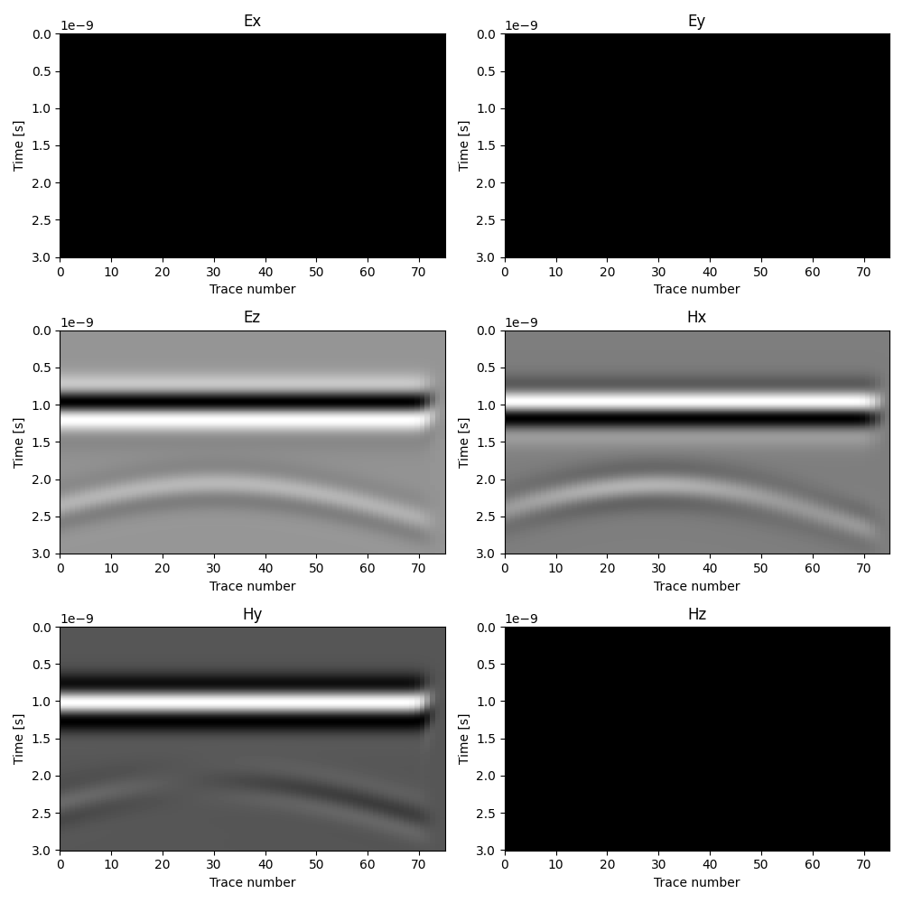
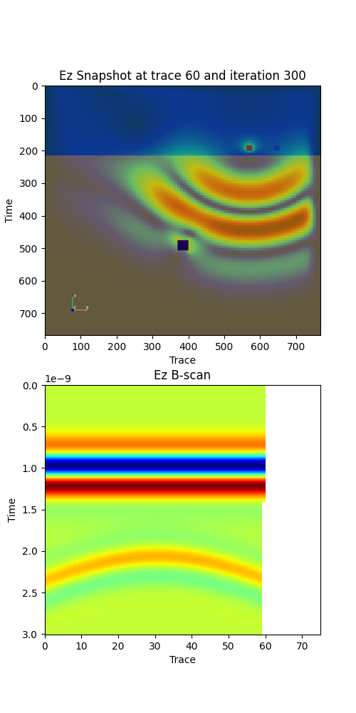
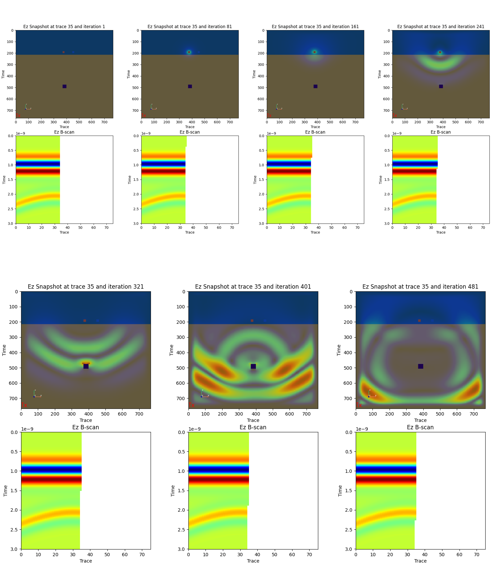

GprMax is open-source software that simulates electromagnetic wave propagation. It solves Maxwell’s equations in 3D using the Finite-Difference Time-Domain (FDTD) method. Although it was designed initially for modeling Ground Penetrating Radar (GPR), it can also be used to model electromagnetic wave propagation for many other applications.  GprMax-UI enhances this functionality by providing a high-level API for executing GprMax models, along with tools for visualization, analysis, and result interpretation.
This tutorial will guide you through the basic steps of using GPRMaxUI to run a simulation and view the results. 

We start by importing the necessary modules.

```Python
from gprmaxui import *
```
We can then proceed to create our GprMaxModel using the following code snippet:
```Python
model = GprMaxModel(
    title="B scan from a single target buried in a dielectric half-space",
    output_folder=Path("output"),
    domain_size=DomainSize(x=0.2, y=0.2, z=0.002),
    domain_resolution=DomainResolution(dx=0.002, dy=0.002, dz=0.002),
    time_window=TimeWindow(twt=3e-9),
)
```
Material properties are defined using the Material class. The following code snippet shows how to define a material with a relative permittivity of 6, conductivity of 0 and relative permeability of 1.

```Python
model.register_materials(
    Material(
        id="half_space", permittivity=6, conductivity=0, permeability=1
    )
)
```
For register model sources. You define a TxRxPair instance and pass it to the model.set_source() method.
```Python
tx_rx_sep = 2e-2
tx = Tx(
    waveform=Waveform(wave_family="ricker", amplitude=1.0, frequency=1.5e9),
    source=HertzianDipole(polarization="z", x=0.03, y=0.15, z=0.0),
)
rx = Rx(x=tx.source.x + tx_rx_sep, y=0.15, z=0.0)

model.set_source(
    TxRxPair(
        tx=tx,
        rx=rx,
        src_steps=SrcSteps(dx=0.002, dy=0.0, dz=0.0),
        rx_steps=RxSteps(dx=0.002, dy=0.0, dz=0.0),
    )
)
```

We continue defining our model by adding the model geometries. For this example, we will add a box to the model domain using the DomainBox class and a sphere using the DomainSphere class. We use meters for defining the geometries dimensions.

```Python
# add model geometries
box = DomainBox(
    x_min=0.0,
    y_min=0.0,
    z_min=0.0,
    x_max=0.2,
    y_max=0.145,
    z_max=0.002,
    material="half_space",
)
model.add_geometry(box)

cx = box.center().x
cy = box.center().y
cz = box.center().z
sphere = DomainSphere(cx=cx, cy=cy, cz=cz, radius=0.005, material="pec")
model.add_geometry(sphere)
```
Finally, we run the simulation using the `model.run()` method.
```Python
model.run(n="auto", geometry=True, snapshots=True)
```
To access the simulation data, you can use the `model.data()` function, which returns a dictionary containing the data for each receiver component. For more information about the data format, please refer to the [GprMax documentation](https://docs.gprmax.com/en/latest/output.html#data-format).
```Python
data_dict = model.data()
for rx_component, data in data_dict.items():
    data_arr, dt = data
```
!!! tip

    You can also check the geometry of your model before running the simulation using the `model.plot_geometry()` function.

    **output**
    
    [{width="400", class="center"}](./../assets/images/plot_geometry.png)


## Visualizing the results

GprMaxUI provides a set of functions to visualize the simulation data and interpret the results.

### Plot data

```Python
model.plot_data()
```

[{width="300", class="center"}](./../assets/images/plot_data.png)


### Plot Snapshots

Snapshots can also be visualized using the `model.plot_snapshot(trace_idx=35, iteration_idx=350)` function. It will be useful to visualize how is the propagation of the wavefront through the model domain at a given time step defined by the `iteration_idx` and the trace index defined by the `trace_idx.`

```Python
model.plot_snapshot(trace_idx=60, iteration_idx=300)
```

[{width="300", class="center"}](./../assets/images/plot_snapshot.png)

We can use that function to create multiple snapshots at a given period of time using the following code snippet:

```Python
from gprmaxui import make_images_grid

captures = []
trace_idx = 35
for i in range(1, 500, 80):
    snapshot_image = model.plot_snapshot(trace_idx=trace_idx, iteration_idx=i, return_image=True)
    captures.append(snapshot_image)
print(len(captures))
output_image = make_images_grid(captures, num_cols=4)
output_image.show()
```

[{ width="600", class="center"}](./../assets/images/plot_snapshot_grid.png)


### Plot Video

Finally, you can create a video of the simulation using the `model.save_video("test.mp4")` function. 
```Python
model.save_video("test.mp4")
```


